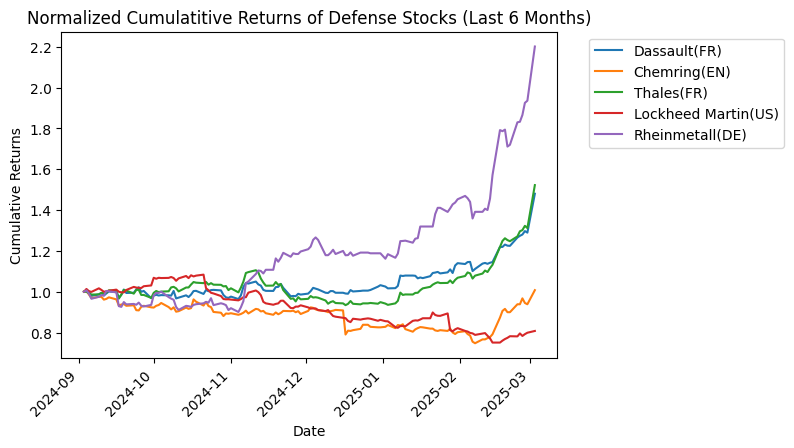
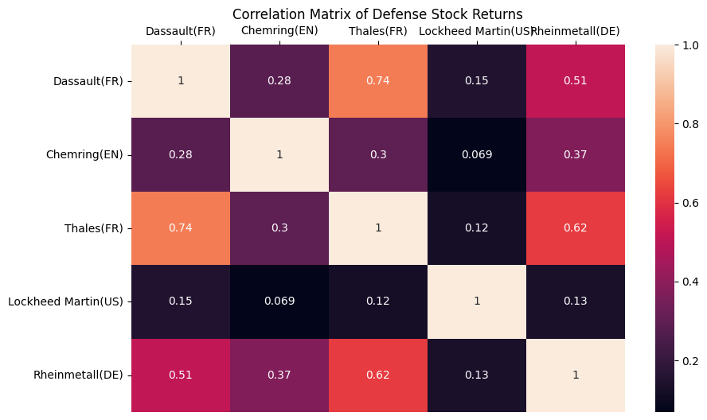
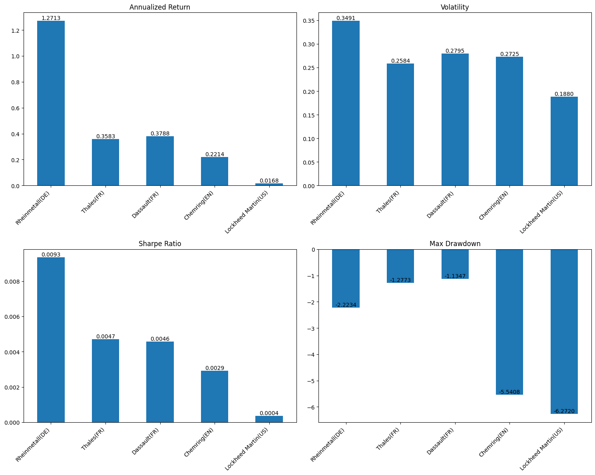
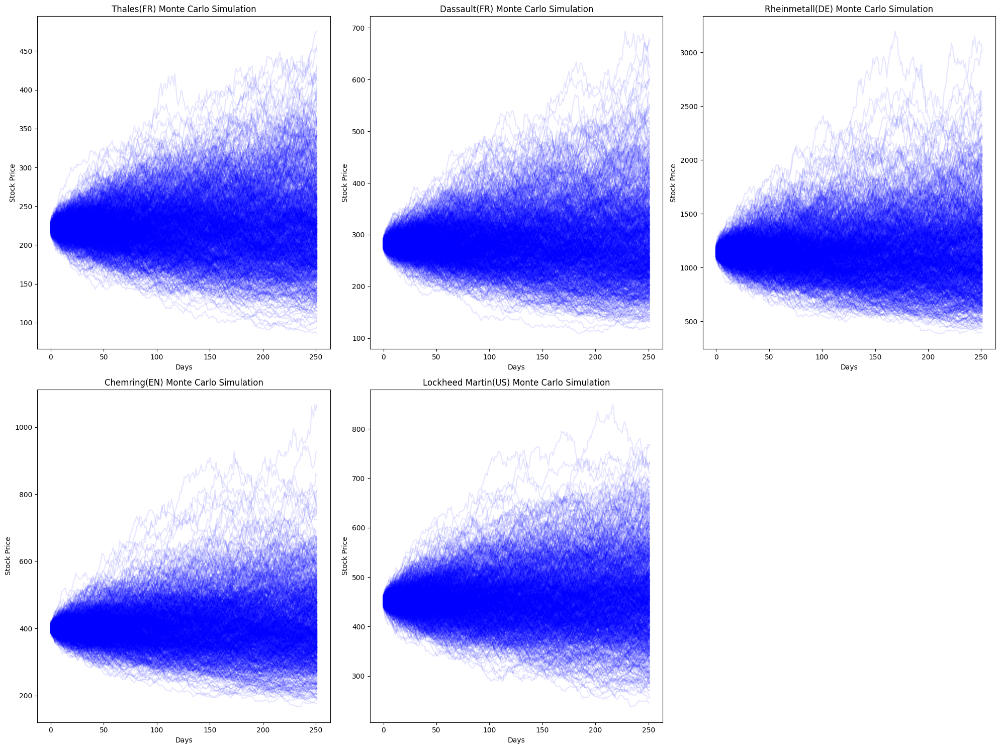
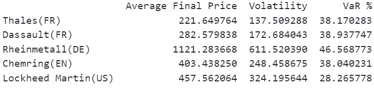

# EU Defense Stocks in a Changing World (2025)

## Context
During the period of the Analysis (March 2023 to March 2025), several factors influenced the defense sector:
1. Ongoing geopolitical tensions.
2. Increased defense spending in Europe with countries aiming to reach/exceed the NATO target of 2% GDP on defense.
3. Technological advancements in areas like cybersecurity, AI, and autonomous systems.
4. Potential shifts in international defense cooperation and trade agreements with the start of Trump second term in the US.

#### Stocks Analyzed:
* **Thales (HO.PA):** French multinational specializing in aerospace, defense, and security.
* **Dassault (AM.PA):** French aircraft manufacturer known for military and business jets.
* **Rheinmetall (RHM.DE):** German defense contractor and automotive parts supplier.
* **Chemring (CHG.L):** British manufacturer of defense equipment and systems.
* **Lockheed Martin (LMT):** American aerospace, defense, arms, security, and advanced technology company.

## Key Takeaways
1. Increased European defense spending and geopolitical tensions drove growth for European companies.
2. Rheinmetall: top performer with exeptional returns, higher volatility and risk.
3. Lockheed Martin underperformed due to reduced European contracts and shifting US priorities.
4. Thales and Dassault showed steady growth and solid risk-adjusted returns.
5. Clear divergence between European and American stocks, indicating a shift towards European self-reliance.

# Analysis
## Cumulative Returns Analysis

**Overall Trend:** European defense stocks show significant growth, especially in the last few months, aligning with the increased defense spending and heightened geopolitical tensions.

**Top Performer:** Rheinmatall appears to have the highest cumulative returns, showing exceptional growth.

**Steady Growth:** Thales and Dassault demonstrate steady growth throughout the period, with acceleration towards the end.

**Lockheed Martin:** The American stock shows more modest growth compared to its European counterparts, and some decline in recent months.

*The growth of European defense stocks can be partly attributed to their focus on emerging technologies. The analyzed companies have made significant investments in areas such as AI, cybersecurity, and autonomous systems, which are becoming increasingly crucial in modern defense strategies*

## Normalized Returns (Last 6 Months)

**1. Divergence**

Clear divergence between European and American defense stocks. This could be due to:
* Increased European defense budget and shift towards self-reliance
* Potential changes in US defense policies and spending

**2. European Stock Surge**

All European stocks show a sudden increase, with Rheinmatall leading the way. This can be linked to ongoing conflicts and tensions, driving demand for defense products.

**3. Thales and Dassault**

Both French companies show similar growth, possibly benefiting from France's strong position in European defense.

**4. Lockheed Martin Decline**

The decrease in Lockheed Martin's stock could be due to:
* Shift of European contracts to local suppliers
* Changes in US defense spending or policies
* Specific company issues or contract losses

Clear shift towards European defense companies, possibly indicating a long-term trend of increased European investments in domestic defense capabilities. The sudden rise in recent months suggests that investors are anticipating sustained growth in the European defense sector.

## Correlation Analysis

**1. European Stock Clustering**

Strong correlations between Dassault, Thales and Rheinmetall reflecting the broader trend of increased European defense spending.

**2. Chemring's Independance**

Chemring's relatively lower correlations with other Europeans stocks indicate that it may behave differently due to its specialized focus or due to not being part of the EU anymore.

**3. Lockheed Martin's Isolation**

Low  correlation with European stocks highlighting distinct market dynamics due to different geopolitical factors, US-centric defense policies, and reliance on US government contracts.

## Performance Metrics Analysis

#### Annualized Return

* **Rheinmetall:** 127.13%, far surpassing its peers, aligning with Germany's commitment to modernizing its military and meeting NATO targets.

* **Thales** and **Dassault:** 35.83% and 37.88% respectively, reflecting France's leadership in European defense and its push for self-reliance amidst shifting NATO dynamics. *In addition, Thales has benefited from cybersecurity contracts while Dassault launched Albatros, a maritime surveillance aircraft.*

* **Chemring:** 22.14%, potentially influenced by its niche focus on countermeasures and post-Brexit trade dynamics.
*Note: as tension rise globally, chemring's electronic warfare systems may see increased demand*

* **Lockheed Martin:** 1.68%, reflecting challenges in maintaining European contracts due to geopolitical tensions and Trump's policies.

#### Volatility
* **Rheinmetall:** 34.91% *(high)* reflecting sensitivity to geopolitical tensions like the Ukraine conflict.

* **Thales** and **Dassault:** 25.84% and 27.95% respectively *(moderate)* driven by steady demand for aerospace and cybersecurity products.

* **Chemring:** 27.25% *(moderate)* influenced by its niche focus.

* **Lockheed Martin:** 18.80% *(lowest)* but at the cost of significantly lower returns.

#### Sharpe Ratio
* **Rheinmetall:** Best risk-adjusted return (0.0093)
* **Thales:** Solid ratio (0.0047) indicating consistent performance
* **Dassault:** Same observation than Thales with solid sharpe ratio (0.0046)
* **Lockheed Matin:** Lowest (0.0004) highlighting underperformance

#### Maximum Drawdown
* **Largest Drawdown:** Lockheed Martin (6.27%) tied to reduced European contracts and shifting US priorities
* **Smallest Drawdown:** Rheinmetall (2.23%) showing resilience amid geopolitical instability.

*Note that while European defense stocks are currently outperforming, the long-term sustainability of this trend depends on several factors. These include the ability of European countries to maintain increased defense spending in the face of potential economic constraints, and the impact of supply chain challenges.*

## Monte Carlo Simulation and Value at Risk 95

*Note: The VaR is calculated based on the simulated future prices a year from now*

Value at Risk (95% confidence) :

* **Riskiest Stock:** Rheinmetall, reflecting significant exposure to geopolitical tensions and defense spending surges, which Rheinmetall is depending on.

* **Lowest Risk:** Lockheed Martin, for which delivery plans in 2025 lead to steady production outlook.

* Thales, Dassault, and Chemring fall into a similar risk category with comparable VaR around 38%, indicating moderate risk but, like Rheinmetall, influenced by geopolitical tensions.

## Next Steps for Investors
1. Monitor geopolitical developments and defense policy shifts in Europe and the US.
2. Track implementation of European Defense Fund and its impact.
3. Lookout for emerging technologies in defense (AI, autonomous systems etc.).
4. Stay informed on cross-border collaborations in Europe and potential supply chain challenges.
5. Assess the long-term sustainability of increased European defense spending.
